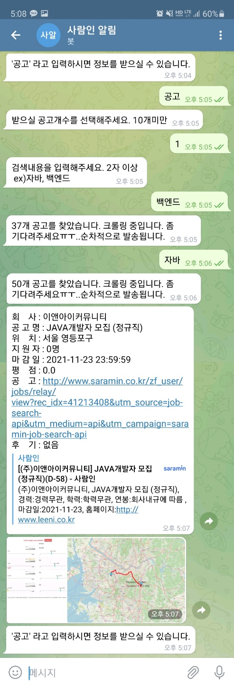
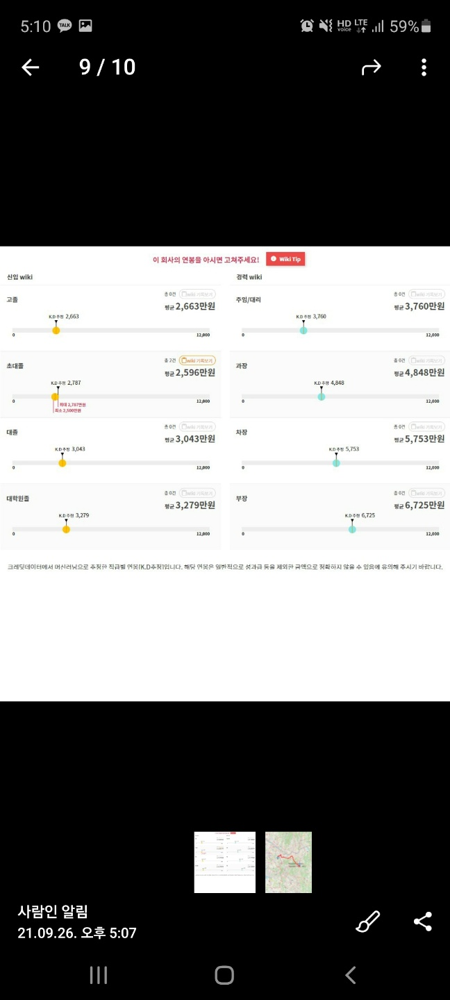

# 사람인API를 활용한 텔레그램 챗봇
### 이용방법
1. 텔레그램 챗봇 친구추가하기
    * 챗봇 이름 : @Saramin_alarm_bot
2. '공고'라고 채팅
3. 응답받을 공고문 개수 입력 (1-9개) 
    * 10개 이상은 가능하나.. 크롤링 로딩오래 걸려서 개선하지 못했습니다.
4. 키워드 입력하기 ex) '자바', '백엔드', '프런트엔드'
5. 조회된 개수가 응답되면서 조회한 공고 개수를 응답함.
6. 이후에는 아래 화면처럼 응답메세지로 전달.
    #### 조회된 정보 내용
     * 사람인API 공고문 내용
     * 잡플래닛 평점 및 후기(최대5개까지)
     * 크래딧잡 연봉 정보
     * 구글맵스 본인 집부터 검색된 회사까지 거리

## 실행화면
</img>
</img>
</img>
